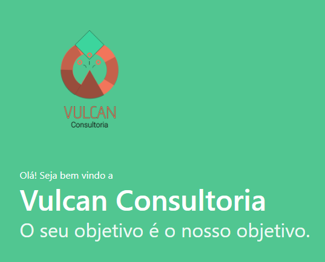

# Site Vulcan

 <!-- Se você tiver uma imagem relacionada ao site, adicione aqui -->

Este é o repositório para o projeto de um site desenvolvido para a empresa fictícia "Vulcan", como parte de um projeto na Faculdade Fatec Campinas.

O site foi construído com base no Framework Bulma, com modificações específicas para se adequar ao escopo do projeto.

## Sobre o Projeto

O objetivo deste projeto é criar um site para a empresa fictícia "Vulcan". Ele faz parte de um projeto acadêmico na Faculdade Fatec Campinas e está sendo desenvolvido por uma equipe de estudantes. O site utiliza o Framework Bulma como base, com personalizações realizadas para atender às necessidades do projeto.

## Equipe de Desenvolvimento

O desenvolvimento deste site está sendo conduzido pelos seguintes integrantes da Fatec:

- Eduardo Dantas
- Gustavo
- Henriky Alves
- Pedro Augusto
- Marcos Alexandre (Eu)

Este projeto também é uma continuação do projeto "E-commerce Bazar Pocotom", que você pode explorar no seguinte link:

- [E-commerce Bazar Pocotom](https://github.com/marcos-rts/Project_ecommerce_TCC)

## Acesso ao Site

Embora o site ainda esteja em desenvolvimento, você pode acessá-lo no seguinte link: [Link para o Site Vulcan](http://vulcan.42web.io/) <!-- Descomente quando o site estiver pronto -->

## Contribuição

Se você tiver sugestões de melhorias ou quiser contribuir com o projeto, fique à vontade para abrir "solicitações de pull request" ou entrar em contato com os membros da equipe.

## Licença

Este projeto é fornecido sob a [licença MIT](LICENSE).

---

*Este é um projeto em andamento, desenvolvido para fins acadêmicos na Faculdade Fatec Campinas.*
